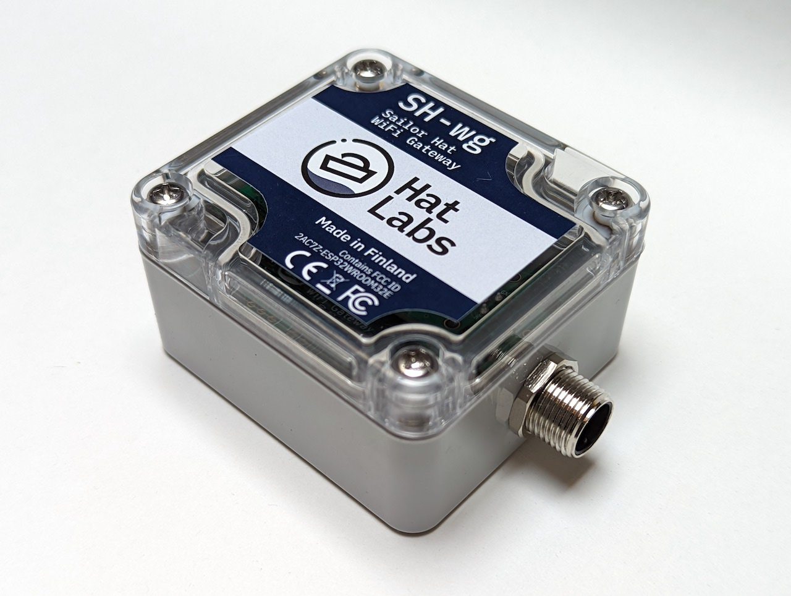

## Introduction

The Sailor Hat WiFi Gateway (SH-wg) allows you to connect WiFi devices to your boat's NMEA 2000 network.
This lets you display your boat data on phones or tablets, extend the NMEA 2000 network wirelessly, or implement a bidirectional interface with Signal K marine data servers.

[NMEA 2000](https://en.wikipedia.org/wiki/NMEA_2000) is a wired networking standard for marine electronics, and is used to connect boat sensor, control and display devices together.
Examples include GPS, depth, wind speed, and engine sensors, autopilots as well as multi-function displays, also known as chart plotters.

Use cases of SH-wg include:

- Display your boat's data on a phone or tablet.
- Connect two network segments wirelessly using two SH-wg devices.
  For example, if you have 12V power cables pulled to your steering pedestal but have little room for pulling the NMEA 2000 cable required for new instruments, you can use two SH-wg devices to connect the steering pedestal devices to your main network.
- Connect your boat network wirelessly to a Signal K server, allowing advanced data processing and visualization.

SH-wg is open hardware and both the [electronics hardware design](https://github.com/hatlabs/SH-wg-hardware) files and [software source code](https://github.com/hatlabs/SH-wg-firmware) are available on GitHub for free download and customization.

SH-wg is available for purchase at the [Hat Labs web store](https://hatlabs.fi/product/sh-wg/).

### Trademarks

NMEA 0183 and NMEA 2000 are registered trademarks of National Marine Electronics Association.
SeaTalk NG is a registered trademark of Raymarine UK Limited.
WiFi is a registered trademark of the Wi-Fi Alliance.
All other trademarks are the property of their respective owners.
