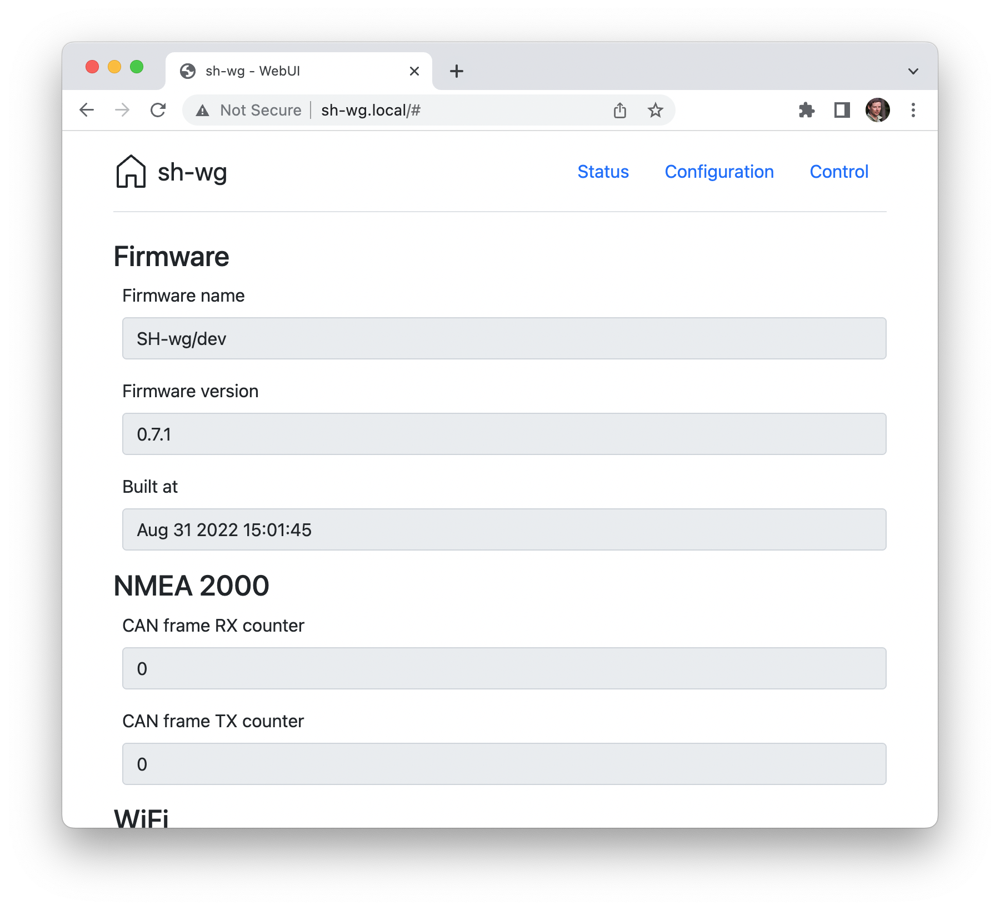
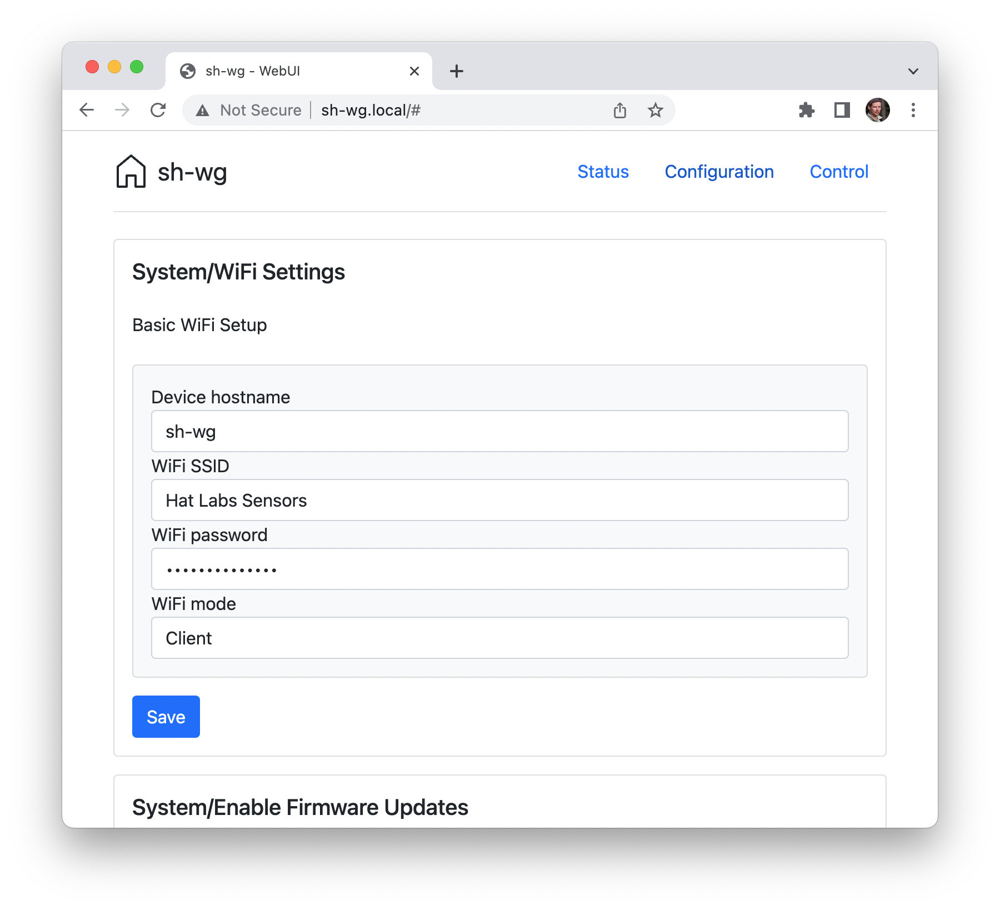
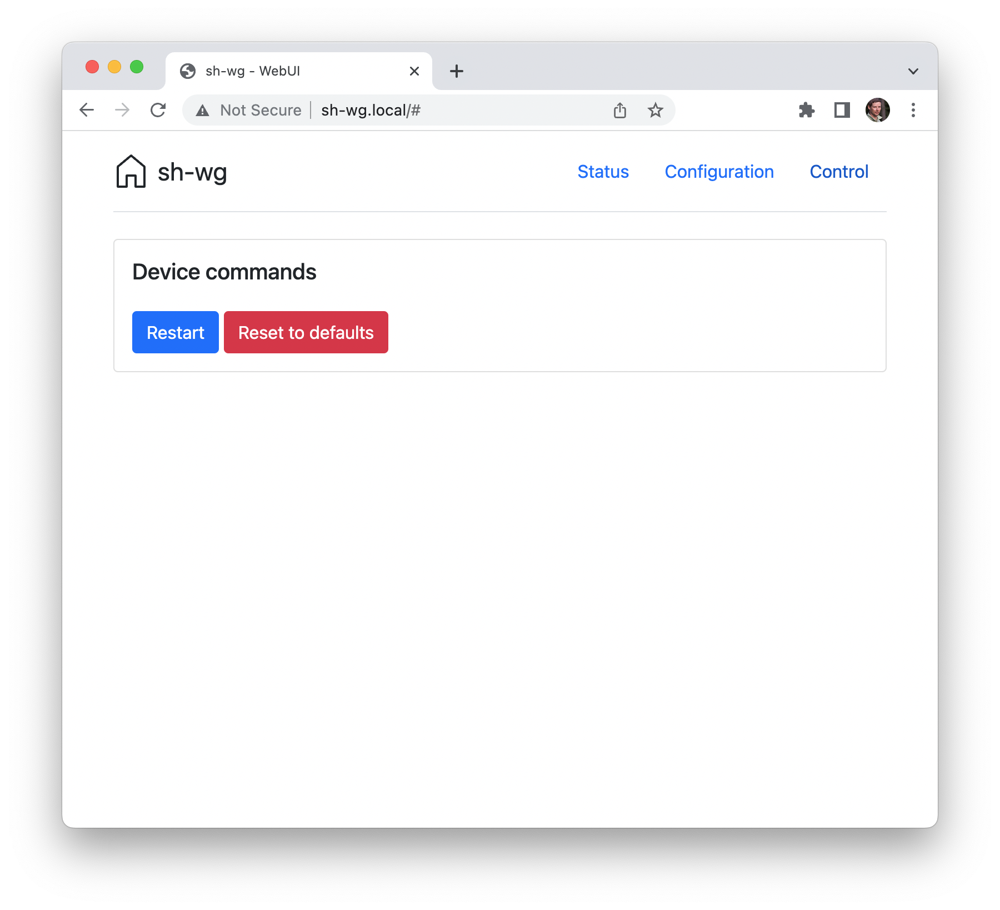
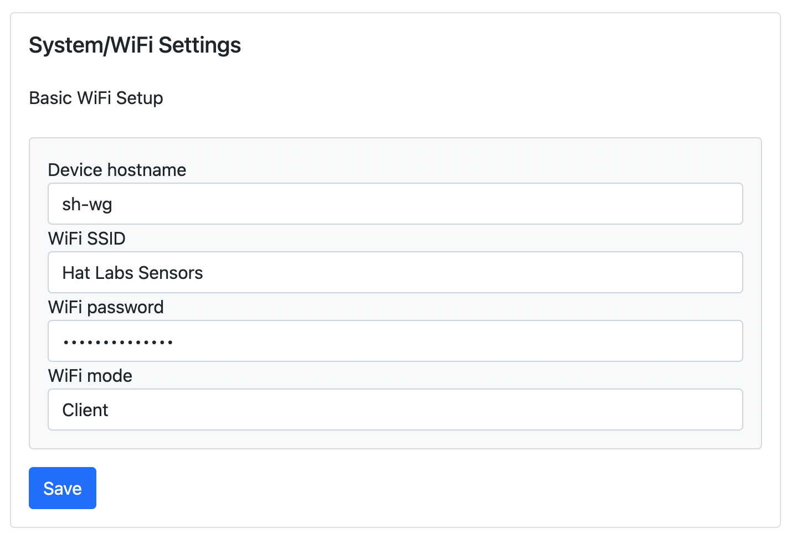
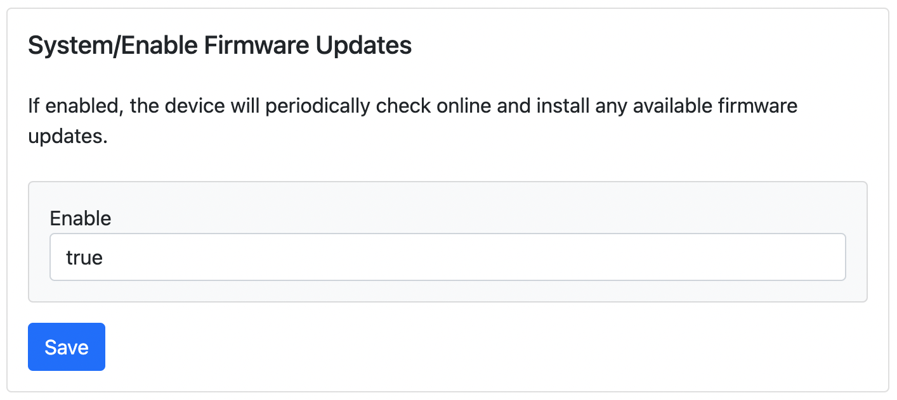
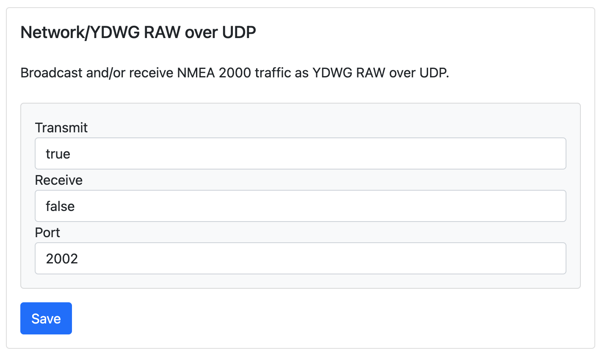

# Configuration

Initial device setup is described in the [Getting Started](/pages/getting_started/) section.
This section focuses on how to configure the device once it is up and running.

SH-wg is configured using a web interface.
If you are connected to the same network as the device, you can access the web interface by opening a web browser and navigating to [http://sh-wg.local/]().
Alternatively, you can enter the device IP address.
In access point mode, the device IP address is always `192.168.4.1`.
In client mode, the device IP address is assigned by the router device via DHCP and usually can be found on the router configuration interface.

The web interface displays the Status page by default, as shown below.
You can navigate to other pages using the top right menu.

The Status page shows useful information on the device and its operation.

The Configuration page allows adjusting run-time configuration settings.
Specific configuration options are described in the following sections.
Note that when changing configuration settings, restarting the device is required for the changes to take effect.

Finally, the Control page allows controlling the device.
At the moment, there are options only for rebooting the device and for resetting the device to factory defaults.

## WiFi Configuration

In the WiFi settings panel, shown below, you can adjust WiFi and network related settings.
The first box allows changing the device hostname.
This determines the mDNS hostname of the device, used for accessing the web UI.
The default value is `sh-wg`, corresponding to the mDNS hostname `sh-wg.local`.

The next three boxes allow changing the WiFi network settings.
In client mode, the device connects to an existing WiFi network using the provided name and password.
In access point mode, the device creates its own WiFi network using the provided name and password.

## Firmware Update Configuration

By default, the SH-wg device tries to check online for available firmware updates every now and then.
If the device is connected to Internet and an update is available, it is downloaded and installed automatically.

If you would like to disable automatic updates, change the Enable Firmware Updates selection to `False`.

## Protocol Configuration

Most panels on the Configuration page are dedicated to configuring the different data protocols supported by the device.
The YDWG RAW UDP control panel is shown below.

It allows you to enable or disable receiving and transmitting YDWG RAW data as well as setting a port number for the UDP socket.

Other panels allow configuring similar settings for the respective protocols.
