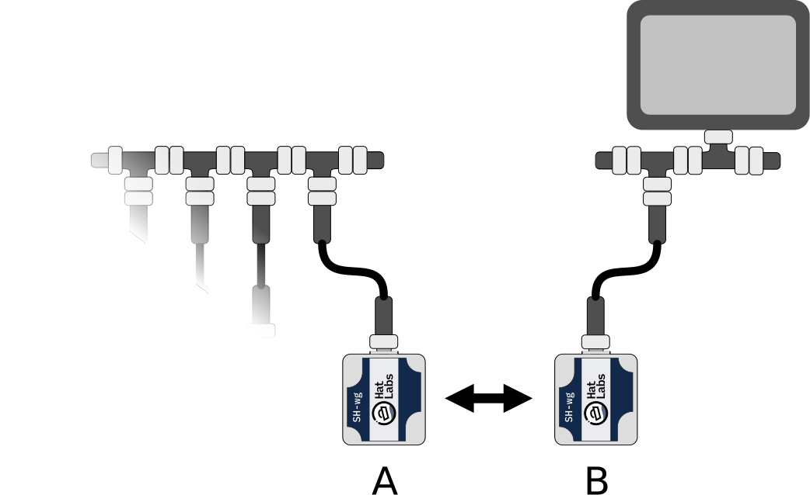

# Getting Started

## Physical installation: Mounting and connecting to N2K

Find a suitable location for installing the SH-wg device.
The following factors need to be considered:

- SH-wg must not be directly exposed to the elements.
  Installation in an instrument pod on the deck is fine but the device should be protected from direct rain or splash water.
- The device should be located close to the WiFi access point (if any) or to the client devices.
  The WiFi range in open air is up to 30m and the signal penetrates fiberglass well, but unnecessarily long distances may still cause communication problems.
- The device should not be placed in a metal enclosure; radio waves will not penetrate metal.
  Special attention to device placement and range should be paid with steel or aluminum boats.
- The device should be placed close to the NMEA 2000 network.
  The maximum allowed length of a drop cable is 6 m.

If you don't know much about NMEA 2000 or would like to have a refresher, have a look at the [NMEA 2000 Primer](../nmea_primer/) before proceeding.

SH-wg can be connected to the NMEA 2000 network either using a standard drop cable or directly to a backbone T-connector.

If you decide to mount the device permanently, take a photo of the bottom sticker for future reference.

The device can be mounted on a surface with screws.
Remove the lid temporarily and attach the device using two screws (3.5 mm or smaller) through the mounting holes.

A piece of two-sided tape can also be used to attach the device on a surface.

Alternative mounting methods include zip-ties or just leaving the device hanging from the network T-connector.

## WiFi Setup

SH-wg can be configured to create a WiFi access point of its own, or to connect as a client to an existing access point.
These two setups are described in the figures below.

On left, we have a device working in access point mode.
The client devices connect directly to this access point and communicate with it directly.
Client devices can also communicate with each other via the SH-wg access point, albeit with a limited performance.
No internet connectivity is provided to any of the devices.
You can have a maximum of 4 simultaneous client devices connected at any time.

On right, we have a typical setup with a separate WiFi router device.
The router creates its own WiFi access point and all client devices connect to it.
Devices communicate with SH-wg via the access point.
Internet connectivity can be optionally provided by the router.

### Common Steps

An unconfigured SH-wg will create its own WiFi access point, a so-called "captive portal".
The user can connect to the captive portal and set the WiFi configuration.

When the configuration portal is activated, the blue LED is blinking.
The device is visible on the computer's WiFi network listing:

The network name is "Configure sh-wg-xxxxxxxxxxxx", the last 12 digits corresponding to the device unique identifier.
When conneting to the captive portal, you also need to provide a password to connect to the configuration portal. The password is "abcdabcd".
**NOTE:** This password is *only* used for connecting to the captive portal during the initial setup.

Once you have successfully connected to the configuration portal, you should be automatically presented with the WiFi configuration front page:

### Configuring WiFi Client Mode

First, follow the steps in the "Common Steps" section above.

Click the "Configure WiFi" button.
You'll get a list of nearby WiFi networks.

One of them should be the boat network you want to connect to.
Select that and enter the network password.
Press "save".

If the SH-wg is able to connect to the configured network, it will restart itself and the blue LED will stop blinking and turn on.
If the configuration failed, the blue LED will keep blinking and you must repeat the operation.

### Configuring WiFi Access Point

First, follow the steps in the "Common Steps" section above.

Click the "Configure WiFi" button.
Now, ignore the list of WiFi networks.
Instead, type in the desired WiFi Access Point name and password in the "Custom Access Point SSID" and "Custom Access Point Password" fields, respectively.

In the figure below, we have configured the access point name to be "My Access Point".

Click "save".

### Changing WiFi Settings

Once the initial configuration has been performed, changing the WiFi settings can be performed in two ways.
First, you can reset the device to factory defaults by following the instructions in the section below and then completing the initial setup again.
Or, second, you can enter the device configuration page and update the settings there. This is described in [Configuration](../configuration/).

## Resetting the Device

If you ever feel you need to start over from the beginning, you can reset the device to factory defaults by using the provided magnet.
Slide the magnet along the side of the device close to the green lights until the red power LED turns off.
Keep the magnet there for 10 seconds (count slowly to 15 to be sure) and then remove it.
The LEDs will flash and the blue LED will start blinking, indicating that the configuration access point is active.
Follow the instructions in section [WiFi Setup](#wifi-setup) above to restart the initial setup.

## Use Case: Transmit NMEA 2000 Data to Apps

Transmitting boat device data to different wireless devices and apps is a common SH-wg use case.
The WiFi may be configured either as a client or as an access point.
In the default configuration, the device broadcasts NMEA 0183 sentences on UDP port 2000 and NMEA 2000 messages in YDWG RAW format on UDP port 2002.
Many apps such as Navionics Boating, iSailor or OpenCPN can receive NMEA 0183 data as is, so no SH-wg configuration changes are needed.
Some apps such as Boating pick up the transmissions automatically while others such as iSailor need to be configured to receive the data.

## Use Case: Wireless NMEA 2000 Bridge

Two SH-wg devices can be used to create a wireless NMEA 2000 bridge.
This setup is useful when the boat's NMEA 2000 network is not accessible from the desired location.
For example, there might be a device pod in sailing boat cockpit with existing power wiring but no NMEA 2000 network.
Or, on a motor boat, flybridge cable ducts might be insufficient for pulling new NMEA 2000 cabling.
In these cases, a wireless NMEA 2000 bridge can be used to connect two separate NMEA 2000 network segments.

Two devices are needed.
Let's call them device A and B.

Device A is connected to the existing NMEA 2000 network segment and configured as an access point.
The device should have a unique hostname.
`sh-wg-a` is used as an example.
The hostname can be configured either during the initial configuration or later via the configuration page.
Device A should also have YDWG RAW TCP server configured to both Transmit and Receive.
Other transmission modes can be turned off or according to the user's needs.

A new NMEA 2000 network segment is created in the new location and device B is connected to it.
Device B is configured as a WiFi client to connect to the access point created by device A.
When setting up device B, unique hostname such as `sh-wg-b` should be used.

Next, the device B should be configured as a TCP client to connect to the YDWG RAW TCP server on device A.
The hostname of device A should be used as the server address.
If the hostname of device A is `sh-wg-a`, then the server address should be `sh-wg-a.local`.

Now, restart the both devices.
At this point, devices should pick up and forward each other's NMEA 2000 messages.

A wireless bridge is not limited to two SH-wg devices.
Multiple client devices can be used to connect multiple NMEA 2000 network segments with each other.

## Use Case: Wireless Signal K Interface

Signal K is an open data format and data exchange platform for marine use.
It allows sharing data between different devices and apps and enables exciting features such as advanced visualization, data logging and connectivity to other open software such as OpenCPN, a popular open source chartplotter application.

SH-wg can be used to connect a NMEA 2000 network to a Signal K server.
Configure the SH-wg device as a client to the WiFi network wo which your Signal K server is connected.
Then, enable YDWG RAW TCP server with both Transmit and Receive on the device.
Once you have done all this, click Save and restart the device.

Finally, connect the Signal K server to the data source.
Open the Signal K server web user interface and navigate to "Server" -> "Data Connections".
Click "Add" to create a new connection.
Data Type should be "NMEA 2000".
Enter "shwg" in the "ID" field.
NMEA 2000 Source should be "Yacht Devices RAW TCP (canboatjs)".
Click Apply and then restart the server by clicking Restart on the top right corner of the page.
You should now see your new "shwg" data source in the Connection activity listing on the SK server Dashboard.
