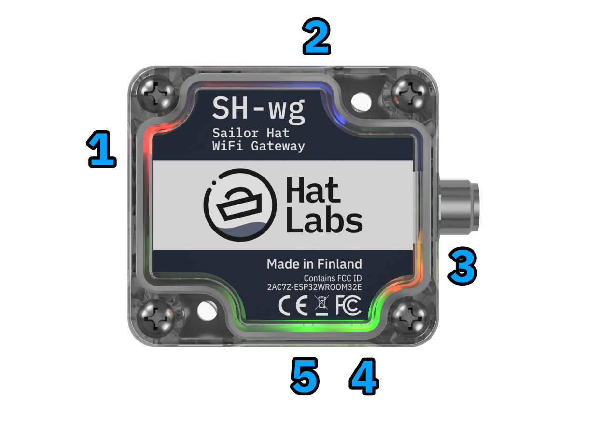
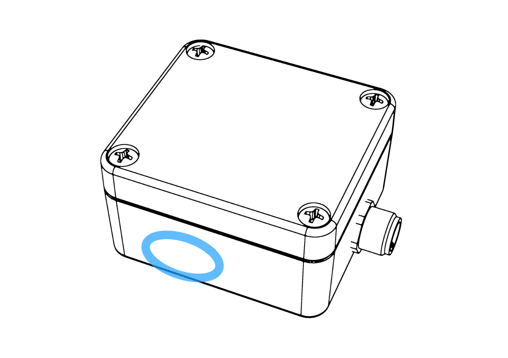

# Hardware Description

The SH-wg enclosure is a polycarbonate box with a transparent lid.
It has a single NMEA 2000 Micro-C connector that transmits both power and data.

The device includes multiple colored LEDs that indicate the status of the device.
There is also a magnet sensor that detects the presence of a magnet.
Both of these are described in sections below.

## LEDs

The SH-wg device includes a number of LEDs that indicate the status of the device.

1. Red: Power LED.
   On when the device is powered.
   Turns off when magnet presence is detected (see the next section).
   Blinks rapidly during an over-the-air update.
2. Blue: WiFi LED.
   Flashes periodically when the configuration portal is activated.
   Flickers (turns briefly off) periodically when the device operates as an access point.
   On when WiFi is connected in client mode.
3. Yellow: Normally on.
   Flickers when data is broadcast over UDP.
4. Green: TX: Flashes when data is transmitted over the NMEA 2000 bus.
5. Green: RX: Flashes when data is received over the NMEA 2000 bus.

## Magnet "Push Button" Interface

To guarantee the integrity of the waterproof enclosure, basic interaction with the device is enabled using a magnet "push button" interface.
Slide the provided neodymium magnet against the enclosure next to the magnet sensor shown in the picture below.

When the magnet is detected, the red LED turns off.

The sensor reacts to two different events:

- One second "button press": restart the device.
- Ten second long "button press": reset the device to factory defaults.
  This can be used to re-enable the configuration portal if the WiFi setup has changed and you are no longer able to access the device.

