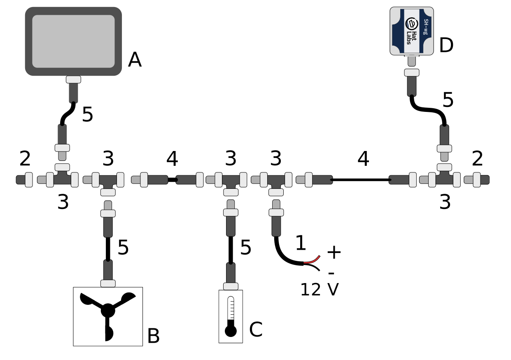

# NMEA 2000 Primer

NMEA 2000 networks come in many different variants. "Micro" cabling with micro connectors is the most common for smaller boats, and is expected in this manual.
Advanced installations may use mini or mid cables that have much larger diameter cables and heftier connectors.
These allow for longer network installations without an excessive voltage drop.
Furthermore, some vendor-specific variants exist as well.
Raymarine's [SeaTalk NG](https://www.raymarine.com/view/index-id=400.html) is probably the most common one.
It uses proprietary connectors but is otherwise fully compatible with a standard NMEA 2000 network.
Adapter cables can be used for connecting regular NMEA 2000 devices to a STNG network and vice versa.

The figure below shows a schematic illustration of a typical NMEA 2000 network.

The figure components are:

<dl>
<dt>A</dt>
<dd>A display device such as a Multi-function Display (MFD).</dd>
<dt>B</dt>
<dd>A wind sensor.</dd>
<dt>C</dt>
<dd>A temperature sensor.</dd>
<dt>D</dt>
<dd>A SH-wg device.</dd>
<dt>1</dt>
<dd>N2K power cable. Every NMEA 2000 network segment must be connected to boat's 12 V power system.
   The power cable must be fused with a 3 A fuse.</dd>
<dt>2</dt>
<dd>Network male and female terminators.
   The network backbone must be terminated with 120 ohm resistors for proper network operation.</dd>
<dt>3</dt>
<dd>Drop cables are connected to the backbone using T-connectors.
   Special 4-way T-connectors are also available for connecting multiple devices to the backbone.</dd>
<dt>4</dt>
<dd>Backbone cables extend the backbone. The maximum length of the network, measured from terminator to terminator,
   should not exceed 100 m.</dd>
<dt>5</dt>
<dd>Drop cables connect individual devices to the backbone.
   The maximum length of the drop cable is 6 m.</dd>

</dl>
