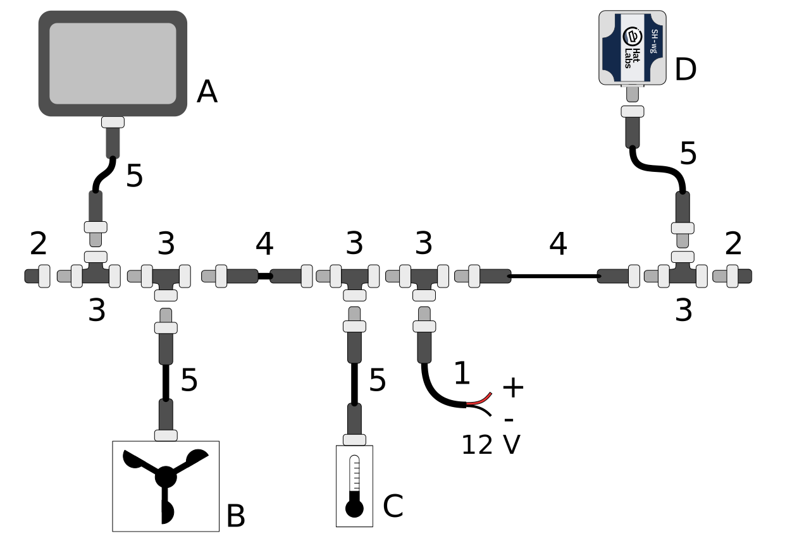

# NMEA Primer

NMEA 2000 and NMEA 0183 are the most common standards for marine data transmission.
They are used for transmitting data between sensors, chart plotters, autopilots, control units and other devices.

# NMEA 0183

[NMEA 0183](https://en.wikipedia.org/wiki/NMEA_0183), originally released in 1983 by the National Marine Electronics Association (NMEA), is an electrical interface and serial data protocol for transmitting data from one "talker" device to one or more "listener" devices.

The electrical standard used is RS-422, but most devices are also compatible with RS-232.
The data rate is 4800 bps.
NMEA-0183 does not define connectors.
Instead, individual wires are typically connected to screw terminal blocks.

The data protocol is based on one-line text sentences.
An example "Water speed and heading" sentence with both true and magnetic heading and speed in both knots and km/h is shown below.

```
$IIVHW,259.,T,237.,M,05.00,N,09.26,K*AE
```

NMEA 0183 is an aging standard with many limitations and being phased out in favor of newer standards, but it is still widely used.
In particular, many devices use the sentence format for transmitting boat navigation data.

# NMEA 2000

[NMEA 2000](https://en.wikipedia.org/wiki/NMEA_2000), a communications standard originally published in 2001 by the National Marine Electronics Association, is a successor to NMEA 0183.
It uses a Controller Area Network (CAN bus) as the electrical interface, with standardized cabling and connectors, and a data rate of 250 kbps.
CAN bus is a vehicle bus standard universally used in the automotive industry, both in cars and in heavy vehicles.
Each device on the bus can transmit and receive messages.

CAN bus transmits data in frames that have 64 bits of header information and up to 64 bits of payload.
NMEA 2000 builds on the J1939 heavy-duty vehicle data protocol for defining a messaging format on top of CAN bus and adds some proprietary extensions for transmitting longer messages.

All NMEA 2000 networks consist of a backbone and one or more drop cables that branch off the backbone using T-connectors.
Both ends of the backbone are terminated with a terminator.
Additionally, the network must have a 12V power feed.

NMEA 2000 networks come in many different variants. "Micro" cabling with micro connectors is the most common for smaller boats, and is expected in this manual.
Advanced installations may use mini or mid cables that have much larger diameter cables and heftier connectors.
These allow for longer network installations without an excessive voltage drop.
Furthermore, some vendor-specific variants exist as well.
Raymarine's [SeaTalk NG](https://www.raymarine.com/view/index-id=400.html) is probably the most common one.
It uses proprietary connectors but is otherwise fully compatible with a standard NMEA 2000 network.
Adapter cables can be used for connecting regular NMEA 2000 devices to a STNG network and vice versa.

NMEA 2000 starter kits, available from boat electronics suppliers, provide the necessary cables and connectors for building a small NMEA 2000 network.
When adding devices to an existing network, a T-connector and a drop cable of appropriate length are needed.

The figure below shows a schematic illustration of a typical NMEA 2000 network.



The figure components are:

<dl>
<dt>A</dt>
<dd>A display device such as a Multi-function Display (MFD).</dd>
<dt>B</dt>
<dd>A wind sensor.</dd>
<dt>C</dt>
<dd>A temperature sensor.</dd>
<dt>D</dt>
<dd>A SH-wg device.</dd>
<dt>1</dt>
<dd>N2K power cable. Every NMEA 2000 network segment must be connected to boat's 12 V power system.
   The power cable must be fused with a 3 A fuse.</dd>
<dt>2</dt>
<dd>Network male and female terminators.
   The network backbone must be terminated with 120 ohm resistors for proper network operation.</dd>
<dt>3</dt>
<dd>Drop cables are connected to the backbone using T-connectors.
   Special 4-way T-connectors are also available for connecting multiple devices to the backbone.</dd>
<dt>4</dt>
<dd>Backbone cables extend the backbone. The maximum length of the network, measured from terminator to terminator,
   should not exceed 100 m.</dd>
<dt>5</dt>
<dd>Drop cables connect individual devices to the backbone.
   The maximum length of the drop cable is 6 m.</dd>
</dl>
